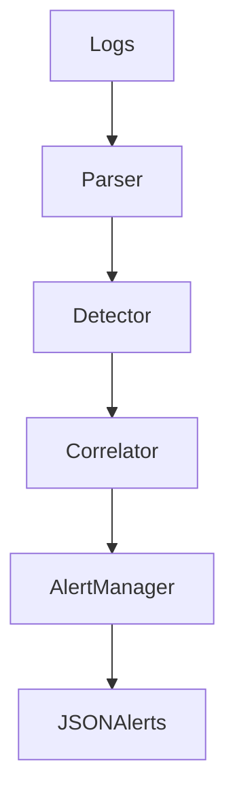

# 🛡️ PySentinel – Real-Time Brute Force Detection Engine

🇧🇷 **Versão em Português:**  

PySentinel é um mecanismo de detecção de ataques de força bruta em tempo real, desenvolvido em Python, que simula o funcionamento básico de um SIEM/IDS por meio da análise e correlação de logs de autenticação.

🇺🇸 **English Version:**

PySentinel is a lightweight real-time brute force detection engine built in Python, designed to simulate core SIEM detection principles. 
It simulates a simplified SIEM/IDS behavior by parsing authentication logs, detecting suspicious patterns, correlating events, and generating security alerts.

---
## 📌 Overview
Brute force attacks remain one of the most common attack vectors against authentication systems.  
PySentinel was developed to simulate detection engineering logic used in Security Operations Centers (SOC), identifying repeated failed login attempts and escalating them into actionable security alerts.
The architecture was intentionally modular to reflect real-world detection pipelines.

This project demonstrates practical knowledge of:

- Log parsing
- Event correlation
- Detection rules
- Alert generation
- Security monitoring concepts

---
## 🚨 Problem It Solves

Authentication logs often contain thousands of entries.  
Manually identifying brute force attempts is inefficient and error-prone.

PySentinel automatically:

- Detects repeated failed login attempts
- Correlates events per IP address
- Triggers alerts when thresholds are exceeded
- Simulates a real-world SOC detection workflow

---
## ⚙️ How It Works

1. Log parser extracts authentication events.
2. Failed login attempts are filtered and normalized.
3. Events are grouped by source IP.
4. A time-based correlation logic evaluates repeated failures.
5. When the configured threshold is exceeded, an alert is generated.

---
## 🧠 Architecture Diagram

---
## 🏗️ Project Structure
pysentinel/

│

├── config.py

├── parser.py

├── detector.py

├── correlator.py

├── alert_manager.py

├── main.py

---
## 🛠️ Technologies Used
- Python 3
- Regular Expressions
- Log Analysis Concepts
- Basic Detection Engineering Principles

---
## 🧠 Detection Logic
- Threshold-based detection
- IP-based event correlation
- Time-window evaluation
- Alert severity classification

---
## ▶️ How to Run
```bash
git clone https://github.com/yourusername/pysentinel-real-time-brute-force-detection.git
cd pysentinel-real-time-brute-force-detection
python main.py
```

---
## 📊Example Output
[ALERT] Possible Brute Force Detected

Source IP: 192.168.0.15

Failed Attempts: 7

Time Window: 60 seconds

Severity: HIGH

---
##🚀 Future Improvements
- Configurable detection thresholds via external config file
- Sliding time-window correlation logic
- Alert export in JSON format
- Integration with ELK stack for centralized logging
- Basic CLI interface for rule management
- Unit tests for detection validation

---
## 👨‍💻 Author

Murillo Henrico W. Gonçalves

Computer Science Student | Cybersecurity Enthusiast


